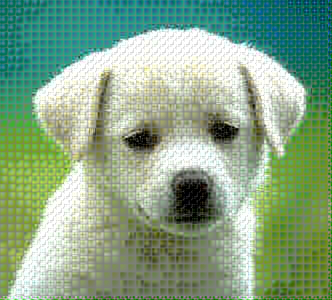

# Requirements

* python 3.6+
* numpy
* pillow
* ~scipy~

Install those libraries using

    $ pip install -r requirements.txt

# Specification

Used DCT instead of FDCT (Fast DCT?)

- Hard to find the formula
- Didn't want to use a library

# Usage

    $ python3 main.py --help

# Encoding

- Added len(dc) and len(ac) information to frame header
- Creates file named {filename}-{m}-{scale}-{n}.pjpg

<!-- hack -->

    $ python3 main.py encode --m <M> --scale <SCALE> --n <N> <filename>

# Decoding

- Loads m, scale, n from the file
- Creates file named {filename}.bmp

<!-- hack -->

    $ python3 main.py decode <filename>

# All In One

Encode + Decode in the single command

    $ python3 main.py aio --m <M> --scale <SCALE> --n <N> <filename>

# Examples

#### Example (Original)

#### Example (24-1-4)

#### Example (24-10-4)

#### Example (24-50-4)

#### Example (24-100-4)

